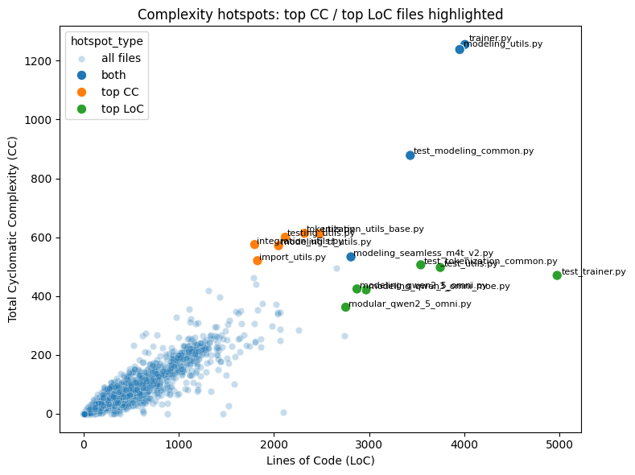
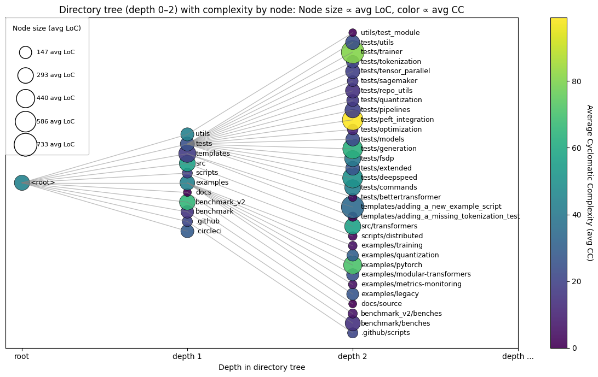
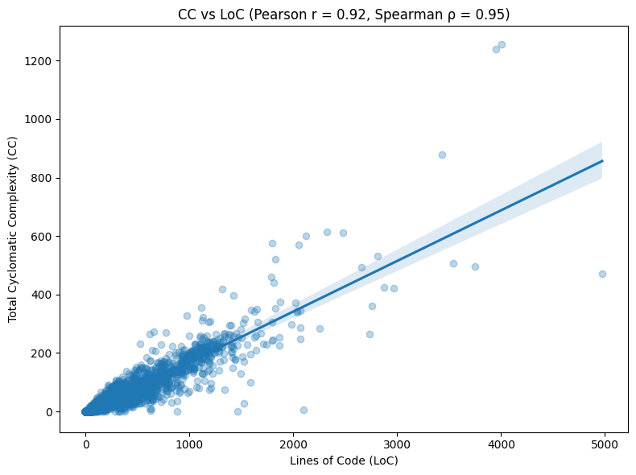
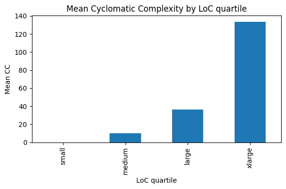
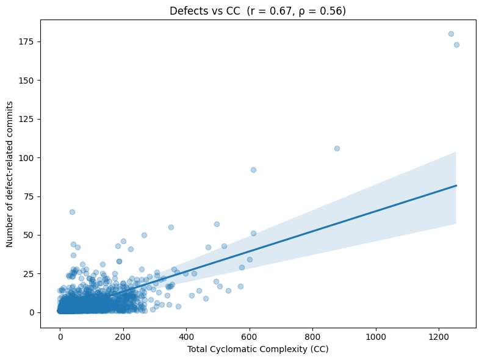
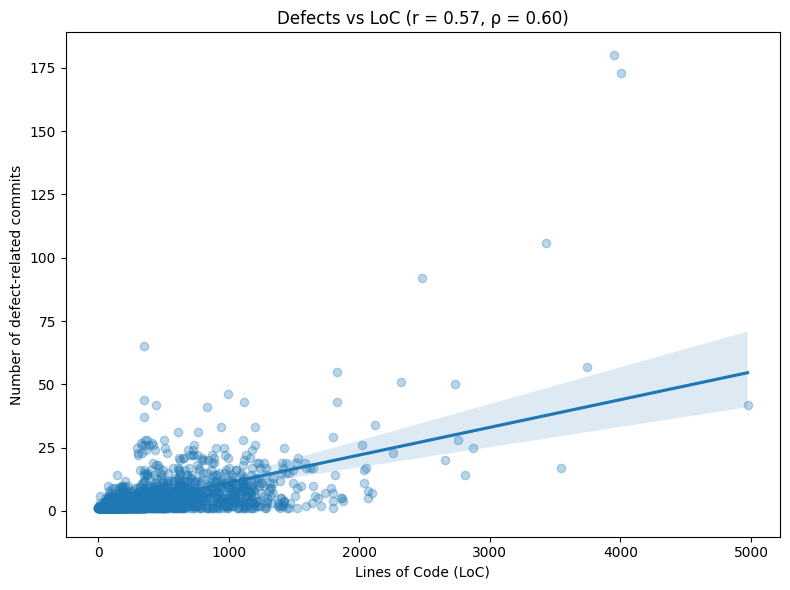

## 2.1 Complexity Hotspots (Task 2)

For Task 2 we selected **Lines of Code (LoC)** and **Cyclomatic Complexity (CC)** as our complexity measures.  
To visualize the complexity hotspots, we combined two complementary perspectives

1. File level analysis to identify the most complex individual `.py` files  
2. Directory level analysis to understand how complexity is distributed across the structure of the repository  

---

### File level hotspots

We first built a LoC versus CC scatterplot, where each point represents a Python file.  
In this visualization, saved as `complexitylocvscc.png`, we highlighted

- Top ten files by CC in orange  
- Top ten files by LoC in green  
- Files that appear in both lists in dark blue  

This allows us to immediately see

- which files are outliers with extremely high LoC and or CC  
- which files are simultaneously long and structurally complex  
- how the two types of hotspots overlap, which in our case is around forty percent  

The highlighted files are reported in the following table

| short_name                   | file_path                                                             |   loc |   cc | hotspot_type |
|-----------------------------|----------------------------------------------------------------------|------:|-----:|--------------|
| trainer.py                  | src/transformers/trainer.py                                          |  4005 | 1255 | both         |
| modeling_utils.py           | src/transformers/modeling_utils.py                                   |  3950 | 1238 | both         |
| test_modeling_common.py     | tests/test_modeling_common.py                                        |  3431 |  878 | both         |
| modeling_seamless_m4t_v2.py | src/transformers/models/seamless_m4t_v2/modeling_seamless_m4t_v2.py |  2808 |  533 | both         |
| tokenization_utils_base.py  | src/transformers/tokenization_utils_base.py                          |  2320 |  613 | top CC       |
| utils.py                    | src/transformers/generation/utils.py                                 |  2481 |  612 | top CC       |
| testing_utils.py            | src/transformers/testing_utils.py                                    |  2118 |  600 | top CC       |
| integration_utils.py        | src/transformers/integrations/integration_utils.py                   |  1797 |  575 | top CC       |
| modeling_tf_utils.py        | src/transformers/modeling_tf_utils.py                                |  2048 |  571 | top CC       |
| import_utils.py             | src/transformers/utils/import_utils.py                               |  1827 |  520 | top CC       |
| test_tokenization_common.py | tests/test_tokenization_common.py                                    |  3541 |  506 | top LoC      |
| test_utils.py               | tests/generation/test_utils.py                                       |  3746 |  497 | top LoC      |
| test_trainer.py             | tests/trainer/test_trainer.py                                        |  4973 |  470 | top LoC      |
| modeling_qwen2_5_omni.py    | src/transformers/models/qwen2_5_omni/modeling_qwen2_5_omni.py        |  2871 |  424 | top LoC      |
| modeling_qwen3_omni_moe.py  | src/transformers/models/qwen3_omni_moe/modeling_qwen3_omni_moe.py    |  2967 |  421 | top LoC      |
| modular_qwen2_5_omni.py     | src/transformers/models/qwen2_5_omni/modular_qwen2_5_omni.py         |  2753 |  362 | top LoC      |

Main observations

- The main cloud of points contains files with low LoC and low CC, while hotspot files are clear outliers  
- Several LoC hotspots are under `tests`, which is expected, because complex scenarios and extensive mocking often require long test files  
- CC hotspots mostly occur inside `src`, including a number of utility modules such as `*_utils.py`, which tend to accumulate heterogeneous logic and many branches  
- Files that are top ten in both LoC and CC are strong candidates for refactoring, since they are both long and structurally complicated  

The scatterplot in `complexitylocvscc.png` therefore provides a precise view of complexity at the level of individual files.

---

### Directory level hotspots

We then moved to a higher level structural view.  
Starting from the file level metrics, we propagated LoC and CC upward through the directory tree and, for each directory node at depth one and two, we computed

- average LoC per file, called `avg_loc`  
- average CC per file, called `avg_cc`  

The resulting visualization, saved as `complexitytree.png`, uses two visual channels

- node size proportional to `avg_loc`  
- node color proportional to `avg_cc` using a continuous colormap  

We limited the depth to two to avoid visual clutter and to keep the interpretation clear.

This tree layout allows us to see complexity not only at file level but also structurally, across the architecture of the project.

What the tree reveals

- At depth one, CC is fairly homogeneous, while LoC varies more between directories. For example the `templates` directory shows large average LoC  
- At depth two, complexity becomes much more heterogeneous. For instance `tests/peft_integration` stands out with high average CC and high average LoC, marking it as a clear structural hotspot  
- This aggregation highlights which branches of the repository are the most complex as a whole, something that the file level scatterplot cannot show directly  
- A possible improvement would be to apply a logarithmic transformation to the average metrics, to make smaller differences more visible without being dominated by extreme outliers  

Overall, the directory level visualization is a useful complement to the file level scatterplot.  
It provides a top down view of structural complexity and helps identify subsystems or directory branches that may require refactoring, not only individual files.

---

## 2.2 CC versus LoC, Part III

To understand the correlation between our two complexity measures, LoC and CC, we used two approaches

1. A scatterplot with a fitted regression line, saved as `complexitycorrelation.png`  
2. Two correlation coefficients, Pearson and Spearman

### Pearson correlation

Pearson correlation evaluates the strength of a linear relationship between two numeric variables using their raw values.  
The coefficient ranges between minus one and plus one

- values near plus one indicate a strong positive linear relationship  
- values near zero indicate weak or no linear relationship  
- values near minus one indicate a strong negative linear relationship  

In our analysis the Pearson correlation between LoC and CC is approximately zero point ninety two, which indicates a very strong positive linear relationship.  
This means that in this repository, files with higher LoC tend to have proportionally higher CC.  
Pearson correlation is sensitive to outliers, which is relevant given the extreme files that we have identified earlier.

### Spearman correlation

Spearman correlation evaluates the strength of a monotonic relationship.  
Instead of using the raw values, it first ranks LoC and CC separately and then computes the Pearson correlation on these ranks.  
The coefficient again ranges between minus one and plus one with the same interpretation, but it is more robust to outliers.

In our case the Spearman correlation between LoC and CC is approximately zero point ninety five, which indicates a very strong positive monotonic relationship.  
As LoC increases, CC almost always increases as well, even if the exact relationship is not perfectly linear.

### Quartile analysis

To further validate this trend, we grouped all files into four LoC quartiles, labelled `small`, `medium`, `large` and `xlarge`.  
For each quartile we computed the mean CC and plotted these values in a bar chart saved as `complexityquartiles.png`.

The quartile analysis shows a clear monotonic progression

- small LoC files show very low CC on average  
- medium LoC files show higher CC  
- large LoC files show significantly higher CC  
- xlarge LoC files show the highest CC by a large margin  

This pattern is consistent with the scatterplot and with both correlation coefficients.

### Conclusion

Both statistical measures and visualizations support the same conclusion

> Files with more lines of code tend to have higher cyclomatic complexity

This result is also intuitive, because longer files naturally tend to contain more branches, conditions and independent execution paths, which directly increases cyclomatic complexity.  
The quartile based view confirms this intuition by showing how average CC steadily increases from the smallest to the largest LoC group.

---

## 2.3 Defects versus Complexity, Part IV

To investigate whether more complex files tend to be more defective, we first computed a defect count for each Python file in the repository.

### Defect counting procedure

A commit was labelled as bug fix related if its message contained at least one keyword from a set of defect related terms.  
The set includes words such as `fix`, `fixed`, `bug`, `bugs`, `error`, `issue`, `issues`, `hotfix`, `regression` and similar.  
This approach is intentionally broad in order to capture a wide range of defect fixing activities.

For every bug fix commit we extracted the list of modified `.py` files using

git show --name-only <sha>

Every time a file appeared in such a commit, its defect counter was incremented by one.  
In this way we obtained a defect frequency per file.  
We then merged this table with the complexity dataset so that each file has LoC, CC and a defect count in a single dataframe.

We again evaluated the relationship with two correlation measures and two scatterplots

- Defects versus CC, saved as `defectsvscc.png`  
- Defects versus LoC, saved as `defectsvsloc.png`

### Defects versus Cyclomatic Complexity

For defects versus CC we obtain

- Pearson correlation around zero point sixty seven  
- Spearman correlation around zero point fifty six  

Both values indicate a moderate positive correlation.  
Files with higher CC tend to appear more often in bug fix commits, although the relationship is noisier than the almost linear LoC versus CC case.  
The scatterplot `defectsvscc.png` shows a clear upward tendency, with many points clustered near low complexity and low defect counts and a sparser cloud for higher values.

### Defects versus Lines of Code

For defects versus LoC we obtain

- Pearson correlation around zero point fifty seven  
- Spearman correlation around zero point sixty  

Again we observe a moderate positive correlation, slightly lower than for CC in Pearson and slightly higher in Spearman.  
Since LoC and CC are themselves strongly correlated, it is not surprising that both metrics show similar levels of association with defect counts.

### Interpretation

Overall, these results support the claim that more complex files tend to be more defective, although the relationship is clearly weaker than the nearly collinear relationship that we observe between LoC and CC.

There is also an important confounding factor. Larger files are more likely to be modified and therefore have more opportunities to appear in bug fix commits.  
This means that some of the correlation between defects and LoC, and consequently between defects and CC, is likely driven by file size.  
A more refined analysis could normalise defect counts by LoC, for example defects per thousand lines of code, in order to reduce this size bias.

Despite these limitations, within this repository the evidence points to a positive association between complexity and defect proneness.  
In other words, more complex files tend to be touched more often in defect related commits.

---

## 2.4 Use of Generative AI (Task 2)

For Task 2, Complexity Analysis, we used a Generative AI assistant strictly as a tutor and helper.  
All final code, plots, interpretations and design decisions were written and validated by us.

In addition, we used AI to translate some of our initial notes and interpretations written in Italian into English for inclusion in this report, while keeping the technical content and conclusions unchanged.

Below we summarise how AI was used.

### Environment and setup

We used AI to clarify how to

- create and activate a Python three point twelve virtual environment  
- generate a `requirements.txt` file from the installed packages  
- check installed package versions  
- update the local clone of the `transformers` repository to the required release tag  

Example prompts

- How do I create and activate a Python three point twelve virtual environment and export a requirements file  
- How can I checkout a specific release tag in a local clone of Hugging Face Transformers  

### Understanding APIs and complexity metrics

We asked AI for explanations of

- how the `lizard` library exposes file level metrics  
- what `analysis.nloc` represents  
- how to iterate over the function list and sum their cyclomatic complexity values  

The implementation of the metric extraction function, including the structure of `analyze_file_complexity` and the integration with pandas, was developed by us.

Example prompts

- How do I compute per file LoC and cyclomatic complexity using `lizard.analyze_file`  
- How do I access the list of functions and their CC values inside the analysis object  

### Improving the visualization of complexity hotspots

AI was used to improve the clarity of our visualisations.  
Initially we only had a raw scatterplot of CC versus LoC.  
We then asked for suggestions on how to

- extract the top ten files by CC and by LoC  
- combine the two lists and mark overlaps  
- display a summary table with these hotspots and annotate them in the scatterplot  

The structure of the final code and the design choices for colours and labels were decided and implemented by us.

Example prompts

- How can I annotate the top ten most complex files in a scatter plot  
- How can I print a table with top CC and top LoC files side by side in a pandas dataframe  

### Statistical interpretation, Pearson and Spearman

We used AI as a tutor to review the mathematical interpretation of the correlation coefficients and to choose appropriate visualisations.  
In particular we asked about

- the conceptual difference between Pearson and Spearman correlations  
- how to compute Spearman by ranking values and then applying Pearson  
- how to present correlations between CC, LoC and defect counts in a clear way  

All computations of correlations, the construction of the regression plots and the quartile based analysis were implemented in our notebook, with AI providing only conceptual support.

Example prompts

- What is the difference between Pearson and Spearman correlation and when should each be used  
- Is it correct to compute Spearman by ranking the values and applying Pearson on the ranks  
- How can I visualise correlations between CC, LoC and defects in a single figure  

### Tree based aggregation and directory level visualization

The hierarchical directory tree visualization was conceptually designed by us.  
This was the most technically demanding part of Task 2, because it required

- aggregating file level metrics upward into directory nodes at depths one and two  
- computing average and total metrics per node  
- representing two metrics simultaneously, using node size for average LoC and colour for average CC  
- laying out and centring nodes along depth levels, and sorting them alphabetically for readability  

AI was used only for technical hints on how to implement this idea.  
For example, we requested help on

- how to propagate metrics from file paths to directory prefixes  
- how to centre nodes vertically within each depth in matplotlib  
- how to scale marker sizes and configure a custom legend that explains the mapping from size to LoC  
- how to enlarge and reposition the legend  
- how to ensure that nodes at the same depth are sorted alphabetically  

Example prompts

- How can I aggregate metrics per directory level starting from file paths  
- How can I display two variables, average LoC and average CC, in a single hierarchical plot  
- How do I centre node positions and create a custom legend in matplotlib  

All high level design decisions, including the choice of depth limit, the use of average values and the final form of the plot in `complexitytree.png`, were completely defined and validated by us.
